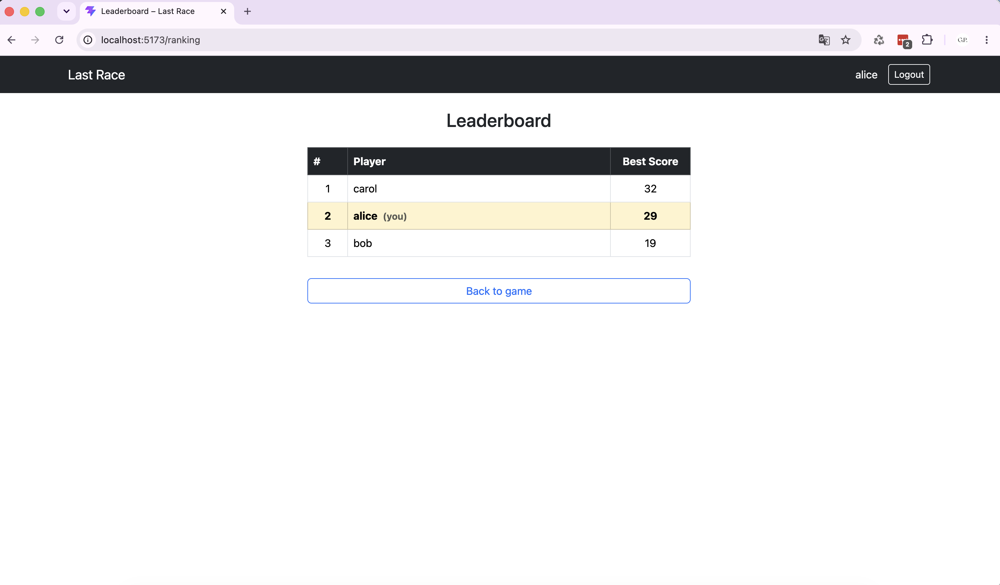
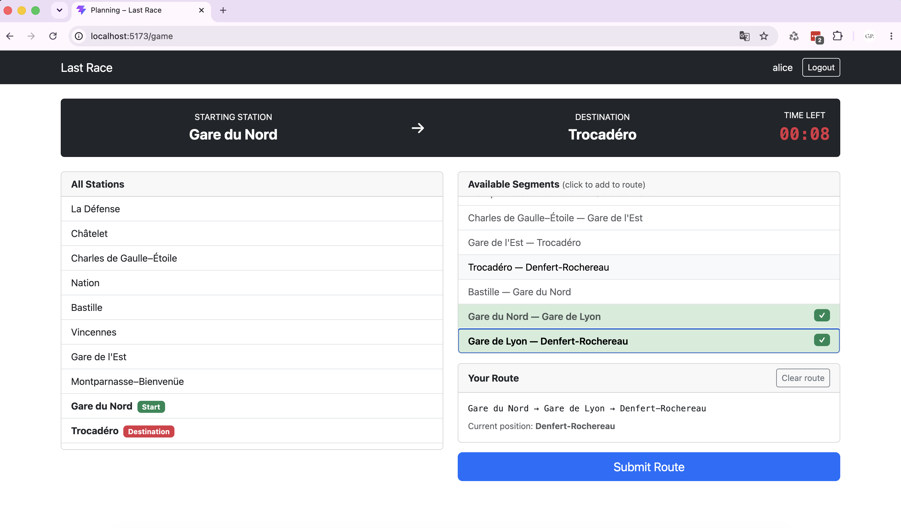

# Exam #1: "Last Race"
## Student: s352024 Piscitello Gabriele

---

## React Client Application Routes

- **`/`** — Home: shows `InstructionsPage` (game rules, login button) for anonymous users; shows `SetupPage` (full network map with lines and interchange stations) for logged-in users.
- **`/login`** — Login form with username + password; redirects to `/` on success; already-logged-in users are redirected to `/`.
- **`/game`** — Full game flow managed by `GamePage`: cycles through Planning → Execution → Result phases. Protected: anonymous users are redirected to `/`.
- **`/ranking`** — Leaderboard table showing best score per player, current user highlighted. Protected: anonymous users are redirected to `/`.

---

## API Server

### Authentication

- **`POST /api/sessions`**
  - Body: `{ username: string, password: string }` (both required, validated with express-validator)
  - Returns `{ id, username }` on success
  - Returns `401 { error }` on wrong credentials
  - Returns `422 { errors }` if username or password are empty

- **`DELETE /api/sessions/current`**
  - Requires authentication (session cookie)
  - Returns `{ message: 'Logged out' }`
  - Returns `401` if not authenticated

- **`GET /api/sessions/current`**
  - Requires authentication (session cookie)
  - Returns `{ id, username }` of the current user
  - Returns `401` if not authenticated

### Network

- **`GET /api/network`**
  - Public (no auth required)
  - Returns `{ stations: [{id, name}], lines: [{id, name, color}], lineStations: [{line_id, station_id, position}], segments: [{line_id, from_id, from_name, to_id, to_name}] }`
  - Segments are one-directional (lower position → higher position); treated as bidirectional in the client

### Game

- **`POST /api/games`**
  - Requires authentication
  - No request body
  - Picks a random valid (start, destination) pair via BFS (distance ≥ 3), creates a game row, stores `{ gameId, startStationId, destStationId }` in the session
  - Returns `201 { gameId, startStation: {id, name}, destStation: {id, name} }`

- **`POST /api/games/:gameId/route`**
  - Requires authentication
  - Param: `gameId` — positive integer (validated)
  - Body: `{ segments: [{from_id: int, to_id: int}, ...] }` — non-empty array (validated)
  - Returns `422 { errors }` on validation failure
  - Returns `403 { error }` if `gameId` does not match the session's current game
  - If route is **invalid**: saves score 0, returns `{ valid: false, reason: string, finalScore: 0 }`
  - If route is **valid**: runs execution (random event per segment, coins start at 20 floored at 0), saves all steps to DB, returns `{ valid: true, steps: [{from, to, event: {description, effect}, coinsAfter}], finalScore: int }`

### Ranking

- **`GET /api/ranking`**
  - Requires authentication
  - Returns `[{ username, best_score }]` ordered by best score descending (one row per user, only completed games)

---

## Database Tables

- **`stations`** — every underground station; columns: `id`, `name`.
- **`lines`** — metro lines with display color; columns: `id`, `name`, `color` (hex string).
- **`line_stations`** — ordered mapping of stations to lines; columns: `line_id`, `station_id`, `position` (integer, determines order on the line). Primary key: `(line_id, station_id)`.
- **`events`** — random events applied during the execution phase; columns: `id`, `description`, `effect` (integer from −4 to +4, enforced by `CHECK` constraint).
- **`users`** — registered players with hashed passwords; columns: `id`, `username`, `password_hash` (hex-encoded scrypt output, 64 bytes), `salt`.
- **`games`** — one record per game; columns: `id`, `user_id`, `score` (NULL until completed), `completed_at` (NULL until completed).
- **`game_segments`** — one record per step in the execution phase; columns: `id`, `game_id`, `segment_order`, `from_station_id`, `to_station_id`, `event_id`, `coins_after`.

---

## Main React Components

- **`NavBar`** (`components/NavBar.jsx`) — top navigation bar; shows the app name, the logged-in username, and a Logout button when authenticated; shows a Login link when anonymous.
- **`PlanningPhase`** (`components/PlanningPhase.jsx`) — the main game-play component; fetches the game start data and network on mount; shows a 90-second countdown timer; lets the player click segments to build a route; auto-submits when the timer expires; sends the route to the server on submit.
- **`ExecutionPhase`** (`components/ExecutionPhase.jsx`) — receives the steps array from the server; shows each segment step-by-step with the random event and updated coin total; "Next stop →" button advances to the next step.
- **`ResultPhase`** (`components/ResultPhase.jsx`) — shows the final score with a contextual message; displays an "Invalid Route" alert if the route was rejected; "Play again" resets the game, "View ranking" navigates to `/ranking`.
- **`GamePage`** (`pages/GamePage.jsx`) — orchestrates the three game phases using a `phase` state machine (`'planning' → 'execution' → 'result'`); protected route (redirects anonymous users).

---

## Screenshots

---

## Users Credentials

| Username | Password    |
|----------|-------------|
| alice    | password123 |
| bob      | qwerty456   |
| carol    | password789 |

---

## Use of AI Tools

AI assistance (Github Copilot and Gemini) was used in the following specific areas during development:

- **Comments:** AI was used to write comments for every utility function (e.g., in `networkUtils.js` and `gameDao.js`) to improve code readability and document parameters and return types. All comments were reviewed and verified to accurately reflect the actual function behaviour.

- **Algorithm design:** AI was used to design and implement the BFS-based utilities in `server/utils/networkUtils.js` (`buildAdjacencyList`, `bfsDistance`, `findValidPair`). The correctness of these algorithms was verified manually against the seeded network data.

- **Bug fixing:** AI helped identify and fix a some bugs.

All AI-generated output was manually reviewed, tested, and adapted where necessary. The overall architecture, database schema design, and game rules implementation were carried out independently.
